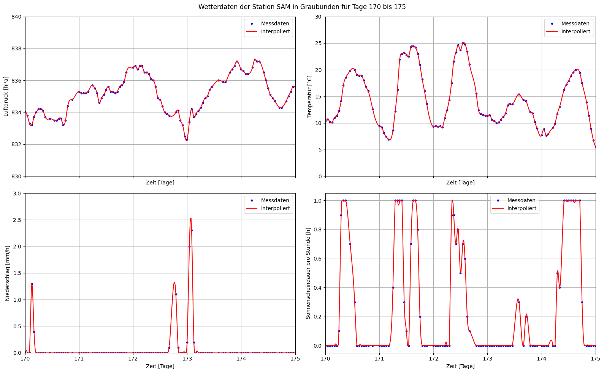
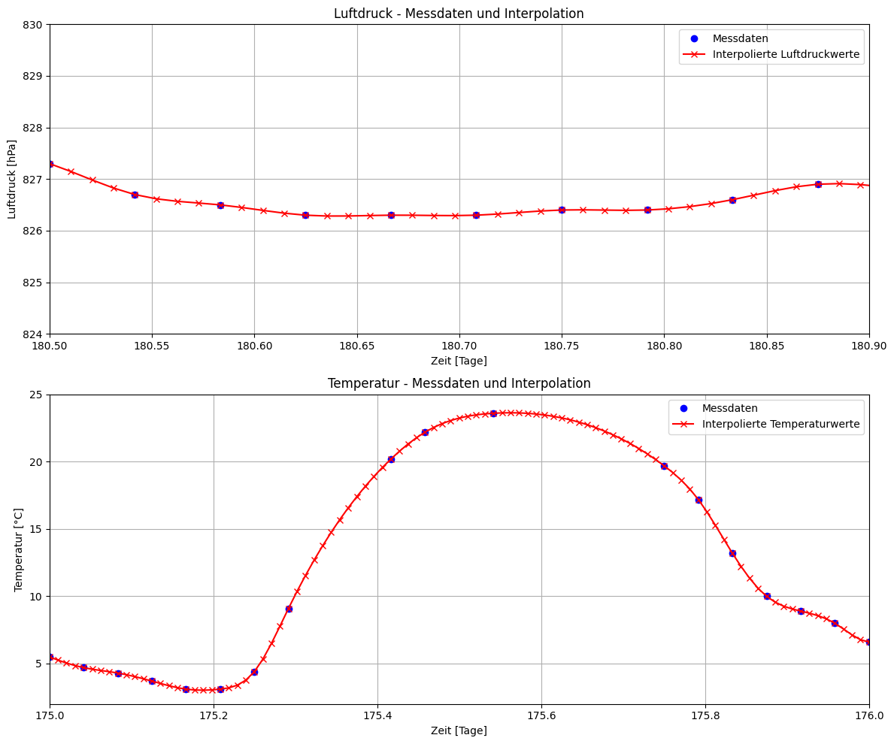
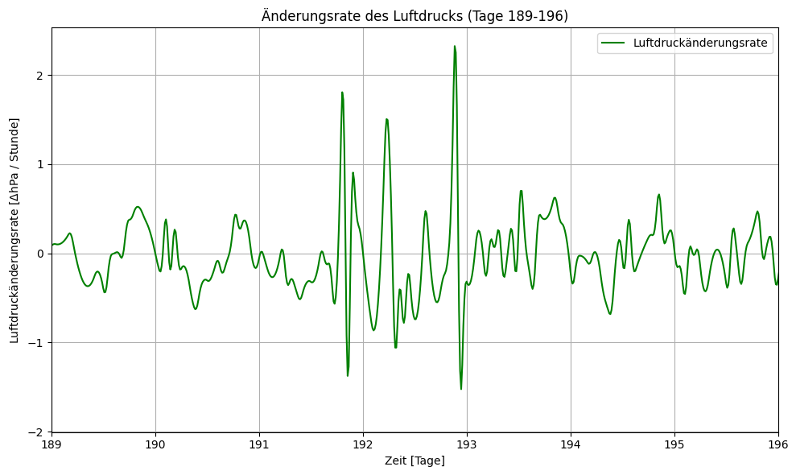
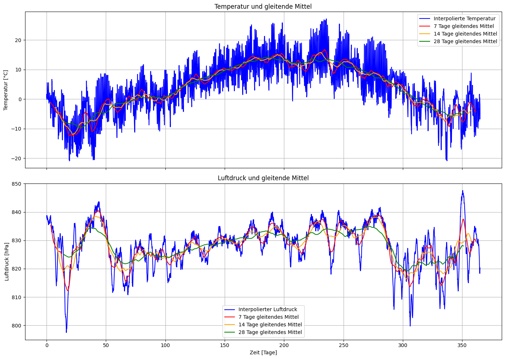

# Weather Data Interpolation and Numerical Analysis

This repository contains a cleaned public portfolio version of a study project completed as part of the course *Numerische Grundlagen der Data Science* in the BSc Applied Digital Life Sciences at Zurich University of Applied Sciences (ZHAW).

The project analyses incomplete weather time series from the **SAM weather station in Samedan, Graubünden, Switzerland**. The focus is on numerical methods, interpolation and data analysis rather than on predictive modelling.

For the assignment, approximately 30% of the original dataset values were intentionally removed by the lecturer. The main objective was to reconstruct the missing values using suitable interpolation methods and to assess the plausibility of the reconstructed weather data.

## Project Objectives

The project demonstrates how numerical methods can be used to reconstruct, analyse and interpret incomplete real-world time series data. In particular, it focuses on:

- preparing and filtering structured weather data
- reconstructing missing values using interpolation methods
- checking the plausibility of interpolated weather values
- analysing temperature, air pressure, precipitation and sunshine duration
- applying numerical differentiation, integration and smoothing techniques
- communicating analytical results through clear visualisations

## Main Topics

- Importing, filtering and preparing structured weather data
- Interpolating incomplete time series using cubic splines
- Comparing measured and interpolated values visually
- Checking the physical plausibility of interpolated results
- Finding zero crossings in the temperature curve
- Computing numerical derivatives to identify large changes in pressure and temperature
- Calculating annual and monthly means using numerical integration
- Smoothing time series with moving averages using discrete convolution
- Interpreting numerical results in the context of real-world weather data

## Tools and Libraries

- Python
- Jupyter Notebook
- NumPy
- pandas
- Matplotlib
- SciPy

## Notebook

The main analysis is contained in the following notebook:

```text
notebooks/ngds_weather_analysis_samedan.ipynb
```

## Data Note

The notebook expects the file `weatherstation_samedan.csv` to be located in the `data/` directory.

The dataset contains weather time series data from the SAM weather station in Samedan, Graubünden, Switzerland. For the assignment, approximately 30% of the original values were intentionally removed in order to apply and evaluate interpolation methods.

No personal data is included in the dataset.

Before reusing or redistributing the dataset, the original source and usage rights should be checked.

## Selected Results

The `images/` folder contains selected visual outputs from the notebook. These figures illustrate the main numerical methods applied in the project, including interpolation, zero-crossing detection, numerical differentiation, numerical integration and moving-average smoothing.

### Weather Data Overview



**Figure 1:** Overview of weather time series from the SAM weather station in Samedan. The figure shows the available measurements for air pressure, temperature, precipitation and sunshine duration over the observed time period.

### Interpolation of Incomplete Weather Data



**Figure 2:** Comparison of measured and interpolated values for air pressure and temperature. Cubic spline interpolation is used to reconstruct missing values and visually assess the plausibility of the reconstructed time series.

### Numerical Derivative of Air Pressure



**Figure 3:** Numerical derivative of air pressure. The rate of change is used to identify periods with strong pressure fluctuations in the reconstructed time series.

### Moving Average Smoothing



**Figure 4:** Smoothed temperature and air pressure time series using moving averages. Discrete convolution is applied to reduce short-term fluctuations and reveal broader temporal trends.

Additional figures are available in the `images/` folder.

## Repository Structure

```text
notebooks/
  ngds_weather_analysis_samedan.ipynb

data/
  weatherstation_samedan.csv
  README.md

images/
  01_weather_data_overview.png
  02_pressure_temperature_interpolation.png
  03_temperature_zero_crossings.png
  04_pressure_rate_of_change.png
  05_temperature_rate_of_change.png
  06_temperature_annual_monthly_mean.png
  07_pressure_annual_monthly_mean.png
  08_precipitation_annual_monthly_mean.png
  09_sunshine_duration_annual_monthly_mean.png
  10_temperature_pressure_moving_average.png

requirements.txt
.gitignore
README.md
```

## How to Run

Clone the repository and install the required Python packages:

```bash
pip install -r requirements.txt
```

Then open the notebook:

```text
notebooks/ngds_weather_analysis_samedan.ipynb
```

Run the notebook cells from top to bottom. The dataset must be available as:

```text
data/weatherstation_samedan.csv
```

## Portfolio Note

This repository is intended as a public portfolio version of a study project. Personal contact details, internal course material and non-essential administrative content have been removed.

The project demonstrates applied Python skills in numerical data analysis, interpolation, visualisation and the interpretation of incomplete real-world time series data.